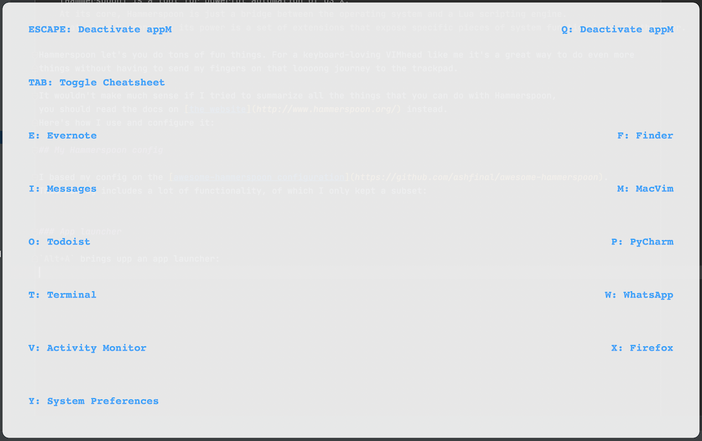
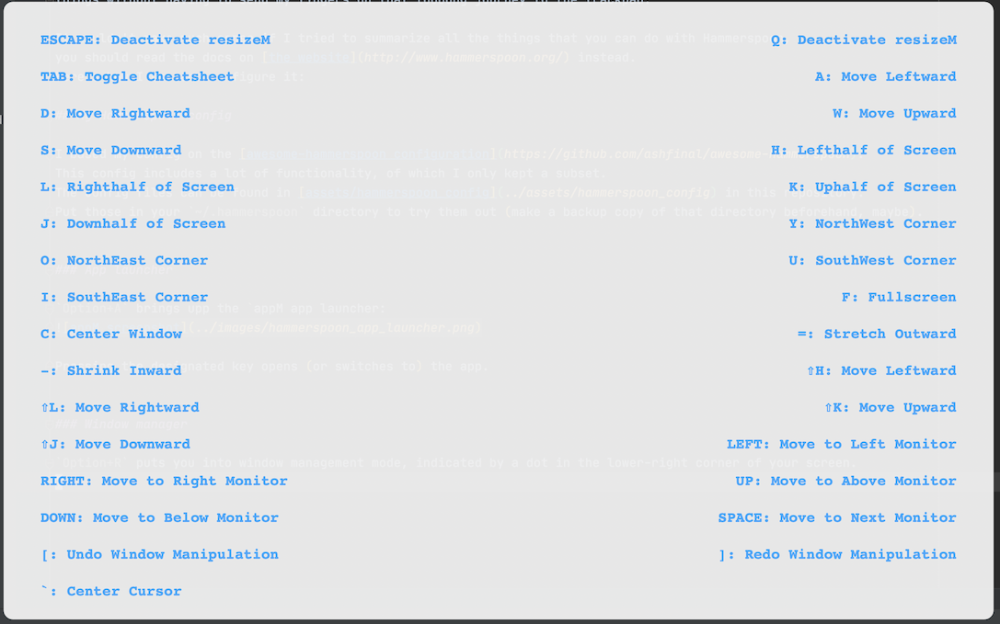

# Hammerspoon: OS X Automation for Pros

What is [Hammerspoon](http://www.hammerspoon.org/)? The web page says

    [Hammerspoon] is a tool for powerful automation of OS X. 
    At its core, Hammerspoon is just a bridge between the operating system and a Lua scripting engine. 
    What gives Hammerspoon its power is a set of extensions that expose specific pieces of system functionality, to the user.
    
Hammerspoon let's you do tons of fun things. For a keyboard-loving VimHead like me it's a great way to get even more done
without having to send my fingers on that loooong journey to the trackpad.
To explore all the available features, read the docs on [the Hammerspoon website](http://www.hammerspoon.org/).
Here's how I use and configure it:

## My Hammerspoon config

I based my config on the [awesome-hammerspoon configuration](https://github.com/ashfinal/awesome-hammerspoon).
This config includes a lot of functionality, of which I only kept a subset and adapted it to my needs.
My current config can be found in [assets/hammerspoon_config](../assets/hammerspoon_config) in this repository.
Put those in your `~/.hammerspoon` directory to try them out. 
(Make a backup copy of that directory beforehand, maybe. 
Also, these files come with no warranty whatsoever, use at your own risk.)

### App launcher

`Option+A` brings up the app launcher:

Pressing the designated key opens (or switches to) the app.

### Window manager

`Option+R` puts you into window management mode, indicated by a red dot in the lower-right corner of your screen.
You stay in that mode until you press `Esc` or `Q` (which may be a bit confusing at first: if you forget to exit window management,
some keys will work as usual while others move around your windows...).
Pressing `Tab` brings up a cheat sheet:

My favorite use case: comparing images by positioning them identically on screen and then toggling back and forth.
* Focus on first window, 
* `Option+R` to go into window management, 
* `c` to center the window, 
* focus on second window, 
* `c` again to center,
* `Q` to exit window management,
* then toggle with `Command+Backtick`.

### Lock the screen

... by hitting `Option+L`

### Vim key bindings for cursor motion!

I saved the best for last: `Fn+h`, `Fn+j`, `Fn+k` and `Fn+l` are mapped to the cursor keys left, down, up and right, respectively.
So I get to use Vim-like cursor motion _everywhere_, e.g. for selecting menu items or when typing text.
This is much faster and more natural than using those little arrow keys (or the trackpad).

Also, `Fn+4` and `Fn+0` are mapped to line End/Start (Home). There are mappings for scrolling and mouse clicks, too, 
but I don't really use them.

<<< Go back to the [table of contents](../README.md) || Opinions are mine, not necessarily those of [Vebeto GmbH](https://www.vebeto.de)