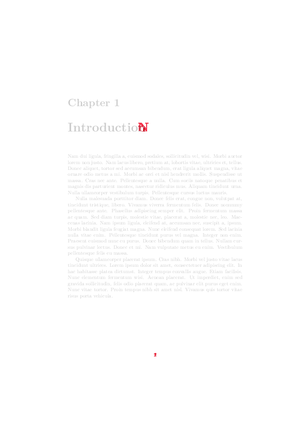

# Pixel-Perfect PDF comParison in Python

If you regularly work with PDF documents, there is sometimes the need to compare two files and find the differences.
For example, I regularly compile analytics reports to PDFs and sometimes want to determine precisely what
has changed between two versions. Another use case would be comparing drafts of a scientific paper.

Of course, if you have access to source files, e.g. the LaTeX code, comparing that is the best way.
But things get more tricky if figures are involved or if you only have the PDFs, not the sources.


## Daddy's little helper
 
Here I'm offering you a little Python script that I use to compare PDF files.
The process is very simple:
* It loads two PDF documents,
* rasterizes each pair of pages (makes pixel images out of them),
* compares the pixels, and 
* outputs an image with the difference pixels highlighted in red.

Here is a page of example output:



You can choose to ignore all pages with very small differences and not produce output for those
(via the ``--iit`` and ``--diii`` options).

This only works if the page layout between the documents is the same. 
If you insert a paragraph somewhere that shifts all text in one documet down by 10 rows, the differences after
that paragraph will be mostly meaningless (until there is a 'synchronizing' page break).
But it works great to find subtle differences in charts, or other smaller changes that leave the
pagination intact.


## The code

```python
"""PDF comparison command line tool"""

import os
import argparse

from wand.image import Image


parser = argparse.ArgumentParser(description="Compare two PDF files page by page.")
parser.add_argument("left", type=str)
parser.add_argument("right", type=str)
parser.add_argument(
    "output_dir", type=str, help="Output directory, is created automatically"
)
parser.add_argument(
    "--start",
    dest="start_page",
    help="start page number, default is 1",
    default=None,
    type=int,
)
parser.add_argument(
    "--end",
    dest="end_page",
    help="end page number, default is min of the two document lengths",
    default=None,
    type=int,
)
parser.add_argument("--dpi", default=75, type=int)
parser.add_argument(
    "--fuzz", default=5, type=int, help="Comparison threshold (0...100)"
)
parser.add_argument(
    "--iit",
    default=0,
    type=int,
    help="Identical Image Threshold: different pixel count below which images are considered identical",
)
parser.add_argument(
    "--diii",
    dest="diii",
    action="store_true",
    help="Don't Ignore Identical Images",
    default=False,
)
args = parser.parse_args()

if not os.path.exists(args.left):
    raise IOError(f"Cannot find file {args.left}")

if not os.path.exists(args.right):
    raise IOError(f"Cannot find file {args.right}")

if not os.path.exists(args.output_dir):
    os.makedirs(args.output_dir)

print("Opening left PDF...")
with (Image(filename=args.left, resolution=args.dpi)) as left_pdf:
    print("Opening right PDF...")
    with (Image(filename=args.right, resolution=args.dpi)) as right_pdf:
        left_images = left_pdf.sequence
        right_images = right_pdf.sequence

        start_page = 1 if args.start_page is None else args.start_page
        end_page = 999_999 if args.end_page is None else args.end_page
        end_page = min(end_page, min(len(left_images), len(right_images)))

        print("Comparing pages...")
        for i, (left_image, right_image) in enumerate(
            zip(
                left_images[start_page - 1 : end_page],
                right_images[start_page - 1 : end_page],
            )
        ):
            left_image.fuzz = left_image.quantum_range * args.fuzz / 100
            diff_image, err = left_image.compare(right_image, metric="absolute")
            print(f"\t{i:6d}, {err:6.0f}", end="")

            if err <= args.iit and not args.diii:
                print(" (skipping)")
            else:
                out_path = os.path.join(args.output_dir, f"diff_{(i + 1):06d}.png")
                print(f" {out_path}")
                diff_image.save(filename=out_path)

```


## Installation

... might be a bit tricky, because you need [ImageMagick](https://imagemagick.org/index.php) and the Python
package [wand](http://docs.wand-py.org) to get it going.
The [wand docs](http://docs.wand-py.org) include installation instructions for various platforms.
You can do that, I bet! :-)


<<< Go back to the [table of contents](../README.md) || Follow on [twitter](https://twitter.com/EberhardHansis) || Opinions are mine, not necessarily those of [Vebeto GmbH](https://www.vebeto.de)