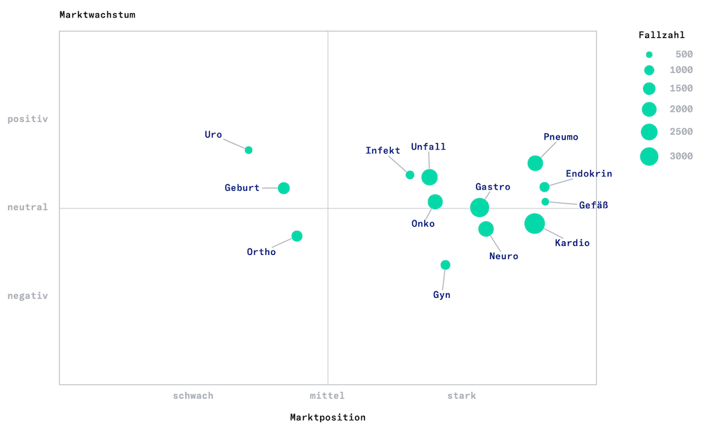

# Label placement for scatter plots with Python and networkx

Automatic label placement is a tricky task.
You might need it to label points in a scatter plot or features on a map, for example.
Labels are supposed to be close to the labeled entity, but without overlapping data points or each other.
Simple hard-coded rules like "10 pixels to the bottom-right" won't work, unless you have very specific constraints 
on the data you are about to plot.

## An example

One of the data displays we use at [Vebeto](https://www.vebeto.de) is a scatter plot summarizing 
the strategic positioning of a hospital.
The end result looks like this, including automatically placed labels:



(Don't worry if you don't understand the German words, they don't matter here...)


## The method

While researching methods for doing the label placement, I came across 
[a discussion](https://stackoverflow.com/questions/14938541/how-to-improve-the-label-placement-for-matplotlib-scatter-chart-code-algorithm)
on StackOverflow, that included [a suggestion](https://stackoverflow.com/a/34697108)
to use the layout methods from the Python [networkx](https://networkx.github.io/) network analysis library for the task.

There is a ``spring_layout`` method in ``networkx`` that does the following, quoting from the 
[networkx docs](https://networkx.github.io/documentation/stable/reference/generated/networkx.drawing.layout.spring_layout.html?highlight=spring#networkx.drawing.layout.spring_layout):

> The algorithm simulates a force-directed representation of the network treating edges as springs holding nodes close, while treating nodes as repelling objects, sometimes called an anti-gravity force. Simulation continues until the positions are close to an equilibrium.

The spring layout also lets you designate some nodes as fixed.
So what we can do is the following:
- Build a network with one node for each point in the scatter plot.
- Mark the point-nodes as fixed.
- Add one (non-fixed) node for each label, add an edge between label and node.
- Let the ``networkx`` spring layout position the labels.

A final detail is that the resulting layout is always mapped into a 1x1 box, so to get back to the
original data scaling we need to undo that.


## The code

Here is what my function for scatter plot label placement looks like.
It follows the ideas of the above-mentioned StackOverflow discussion, and adds some details
for handling edge cases (single points or all points identical), dis-ambiguating points with identical
coordinates and deterministic random state.

I'm plotting with [Altair](https://altair-viz.github.io/), but since the method just computes label coordinates the given
data point coordinates, it can be used with any potting framework.

```python
def scatter_label_placement(point_x, point_y, k, epsilon=1.0e-6, random_seed=3456):
    """Place labels for a scatter plot using a graph spring layout

    Roughly follows: https://stackoverflow.com/a/34697108

    Args:
        point_x (iterable): x coordinates of points
        point_y (iterable): y coordinates of points
        k (float): spring constant (e.g. 0.1)
        epsilon (float): scaling for random jitter to dis-ambiguate points
        random_seed (int): random seed to use for placement, keep fixed for reproducible results

    Returns:
        label_x, label_y: coordinates for labels (lists)
    """
    import random
    import networkx as nx
    import numpy as np

    # store current random state, seed
    rand_state = random.getstate()
    random.seed(random_seed)

    if len(point_x) != len(point_y):
        raise RuntimeError("Inconsistent coordinate array lengths")

    if len(point_x) == 0:
        return [], []

    graph = nx.Graph()

    data_nodes = []
    label_nodes = []
    initial_pos = {}
    pos_to_label_id = {}

    # always append a shifted mean point to dis-ambiguate scaling in case
    # all points are identical or only one point is given
    point_x = list(point_x)
    point_y = list(point_y)
    point_x.append(np.mean(point_x) + 0.1 * np.mean(point_x) - 0.5 * np.std(point_x))
    point_y.append(np.mean(point_y) + 0.1 * np.mean(point_y) - 0.5 * np.std(point_y))

    # generate graph
    for i, (x, y) in enumerate(zip(point_x, point_y)):
        data_id = "data_{0}".format(i)
        label_id = "label_{0}".format(i)
        graph.add_node(data_id)
        graph.add_node(label_id)
        graph.add_edge(data_id, label_id)
        data_nodes.append(data_id)
        label_nodes.append(label_id)
        initial_pos[data_id] = (x, y)
        initial_pos[label_id] = (x, y)
        pos_to_label_id.setdefault((x, y), []).append(label_id)

    # for any identical initial positions, add tiny random shifts (otherwise nx doesn't place labels apart)
    for pos, labels in pos_to_label_id.items():
        if len(labels) > 1:
            for label_id in labels:
                initial_pos[label_id] = (
                    pos[0] + random.random() * epsilon,
                    pos[1] + random.random() * epsilon,
                )

    # do layout
    nx_pos = nx.spring_layout(graph, pos=initial_pos, fixed=data_nodes, k=k)

    # undo nx layout scaling: nx re-scales and shifts to fit all data in a [0...1, 0...1] square

    pos_after = np.vstack([nx_pos[d] for d in data_nodes])
    pos_before = np.vstack([initial_pos[d] for d in data_nodes])
    scale_x, shift_x = np.polyfit(pos_after[:, 0], pos_before[:, 0], 1)
    scale_y, shift_y = np.polyfit(pos_after[:, 1], pos_before[:, 1], 1)

    label_x = []
    label_y = []

    # apply scaling, exclude last (appended) point
    for label_id in label_nodes[:-1]:
        label_x.append(nx_pos[label_id][0] * scale_x + shift_x)
        label_y.append(nx_pos[label_id][1] * scale_y + shift_y)

    # restore previous random state
    random.setstate(rand_state)

    return label_x, label_y
```


<<< Go back to the [table of contents](../README.md) || Follow on [twitter](https://twitter.com/EberhardHansis)