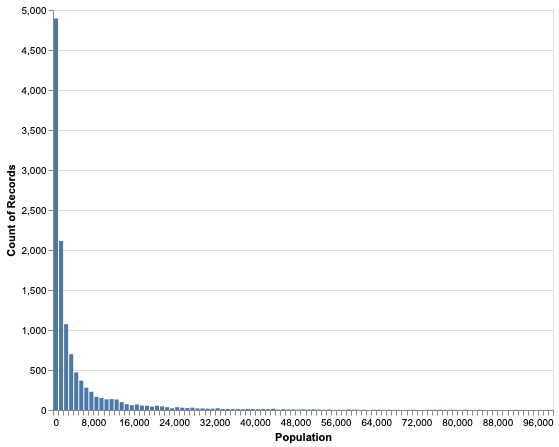

# Use a Weighted Percentile Rank to Benchmark against Skewed Distributions

When you are presenting data, for example in a report or dashboard, it is often a good idea to indicate if
a certain value is 'large' or 'small', compared to benchmarking data.
As we will see in the following, using a weighted percentile rank is a good way to determine size for such a benchmarking.

Many distributions that you find in the real world are highly skewed: there are many entities with small
values and very few entities with large values.
This is true, e.g., for the size distribution of companies (lots of small companies, very few really big ones),
the distribution of income (many with low wages, very few billionaires) or
the number of followers on twitter (lots of people with just a few followers, very few big influencers).
In many cases, these follow [Power law distributions](https://en.wikipedia.org/wiki/Power_law).


## Population size distribution

As an example of such a distribution we are going to look at the size distribution of settlements (villages, towns, cities) in Germany.
I pulled these from the [GeoNames](http://www.geonames.org/) database.
The actual data is not included in this repo, but you can freely download it from GeoNames.
All plotting and analysis code is contained in [geonames_population_distribution.py](../assets/geonames_population_distribution.py).
(Disclaimer: I'm not sure that the GeoNames DB doesn't double-count settlement units that are parts of larger units.
For the point of this example, this doesn't matter, though.)

This is a histogram of population size per settlement, clipped to a max of 100,000 population 
(to be able to resolve small population values):



Here is the distribution of the settlement size plotted as a cumulative probability distribution.
Population per settlement is shown on the vertical axis. 
The value on the horizontal axis gives you the percentage of settlements that have the respective number of 
inhabitants or less.


As you see, for about 90% of settlements in the database the population is so small (compared to the largest value),
that the line is barely discernible from the horizontal axis.
Then, for the last few percent of settlements the population spikes.

Here is the same data again, but now plotted with a logarithmic vertical axis:


50% of the settlements in the database have less than 1,500 inhabitants, 
90% have less than 15,000 people living there.
Only about 2% of places have a population of 100,000 or more.
So this is really a heavily skewed distribution.
([Zipf's law](https://en.wikipedia.org/wiki/Zipf%27s_law) is often cited for describing population distributions.)


## Is this large?

Now we get to the actual point of this post.
Let's pick Heidelberg as an example city.
It has a population of 143,345 (according to the GeoNames version that I used).
Is this a 'large' city? Or rather medium-sized?

Compared to the largest settlement, Berlin with 3.4 million inhabitants, it's comparatively small.
Yet, it's the 65th largest city in Germany (rank 12005 among 12069 places).
We can convert this rank to a **percentile rank**, which is (close to) zero for the smallest settlement and 100 for the largest,
to normalize out the length of our list.
In that measure, Heidelberg would come in at 99.47, which appears quite high.
In fact, if you only saw that number (and didn't know anything about Heidelberg), you might expect it to be much larger than it actually is.

If you wanted to apply a label to a city to benchmark its size, you could take the percentile rank ``p`` and convert it as follows:
* ``p < 10``: very small
* ``10 <= p < 30``: small
* ``30 <= p < 70``: medium
* ``70 <= p < 90``: large
* ``p >= 90``: very large

You can of course pick other labels and thresholds, this just illustrates the original task of applying a benchmarking
label to an entity. According to the above definition, we would say that Heidelberg is 'very large'.

Here are the results for a few more example places:
```text
Berlin      : population =  3426354, n-th largest =      1, percentile rank =  100.000
Hamburg     : population =  1739117, n-th largest =      2, percentile rank =   99.992
Stuttgart   : population =   589793, n-th largest =      7, percentile rank =   99.950
Heidelberg  : population =   143345, n-th largest =     65, percentile rank =   99.470
Buxtehude   : population =    38192, n-th largest =    345, percentile rank =   97.150
Asselfingen : population =     1075, n-th largest =   6908, percentile rank =   42.771
Elend       : population =      583, n-th largest =   8889, percentile rank =   26.357
Sorge       : population =      140, n-th largest =  11705, percentile rank =    3.024
```

(`n-th largest` is the length of the city list minus the 0-based ascending rank.)

What do we see here?
The percentile rank isn't really conveying a good intuition about the size of a settlement.
It barely changes until settlements become quite small - from the value of 97.15 for Buxtehude you might greatly over-estimate its size,
applying a label of 'very large' according to the above scheme.


## Big little bias

There is another issue with using the percentile rank (or the rank or 'n-th largest') as an indicator for 'intuitive' benchmarking:
The percentile rank changes substantially if we add or remove a large number of small entities.
For example, we might classify the very small settlements as not worth analyzing and
drop them from the list.
If we set a minimum size of 1,000 people, we would lose about 40% of the list, with ranks changing accordingly.
Suddenly, a place with population of 1,037 would have a percentile rank around zero instead of the previous value of around 40.


## Weighty rescue

If you want to compute a measure for benchmarking against such highly skewed distributions, I propose that you
use a **weighted percentile rank** instead.
The percentile rank as computed above gives you the percentage of _settlements_ that are of equal or smaller size than the one you are looking at.
The **weighted** percentile rank gives you the percentage of _people_ that live in settlements of equal or smaller size than the one you have picked.
This corresponds to the [weighted percentile method](https://en.wikipedia.org/wiki/Percentile#The_weighted_percentile_method) with the weights
being equal to the values themselves.

In a picture, you could also imagine this as follows:
For each settlement, cut a piece of string that is proportional in length to its population.
Lay out these strings one after another, sorted from shortest to longest.
Now, measure the length from the start of all strings to the one representing your city and compare it to the total length.
This fraction, converted to a percentage, is the weighted percentile rank.

Some more examples of how to interpret this:
* If you are looking at income distribution, the weighted percentile rank of a certain income level would tell you
  the percentage of money earned cumulatively by people with this income or less, compared to the total cumulative income.
* For the example of Twitter followers, the weighted percentile rank of a certain follower count tells you the percentage of 
  follower relationships enjoyed by people with this number of followers or fewer, compared to the total number of follower relationships.

(Disclaimer: There are probably other names apart from 'weighted percentile rank' for this measure. 
Apologies if I don't mention your favorite name here.)
  
  
## Some code for you

Here is a Python function that computes the weighted percentile rank from a `pandas.Series`:
```python
def weighted_percentile_rank(s):
    """Get weighted percentile rank

    Highest rank is guaranteed to be 100 (unless the input series is all zeros or empty).
    Equal values get the same (max) rank.

    Args:
        s (pd.Series): input data

    Returns:
        pd.Series: percentile rank of values, in range 0-100; same index and order as input data
    """
    if len(s) == 0:
        return pd.Series()

    if (s < 0).any():
        raise ValueError(
            "Cannot compute weighted percentile rank of series including negative values"
        )

    data = s.sort_values()

    # compute weighted percentile per value
    cumsum = data.cumsum()
    cmax = cumsum.max()

    if cmax > 0:
        ranks = cumsum / cumsum.max() * 100.0
    else:
        ranks = cumsum

    # map from values to rank, map values to ranks via max of ranks for each value
    v2r = ranks.groupby(data.values).max()
    perc_rank = data.map(v2r)

    return perc_rank.loc[s.index]
```


## Am I helping?

Let's look at the example city stats again, now including the weighted percentile rank:
```text
Berlin      : population =  3426354, n-th largest =      1, percentile rank =  100.000, weighted perc. rank =  100.000
Hamburg     : population =  1739117, n-th largest =      2, percentile rank =   99.992, weighted perc. rank =   96.063
Stuttgart   : population =   589793, n-th largest =      7, percentile rank =   99.950, weighted perc. rank =   90.082
Heidelberg  : population =   143345, n-th largest =     65, percentile rank =   99.470, weighted perc. rank =   71.405
Buxtehude   : population =    38192, n-th largest =    345, percentile rank =   97.150, weighted perc. rank =   50.919
Asselfingen : population =     1075, n-th largest =   6908, percentile rank =   42.771, weighted perc. rank =    3.018
Elend       : population =      583, n-th largest =   8889, percentile rank =   26.357, weighted perc. rank =    1.178
Sorge       : population =      140, n-th largest =  11705, percentile rank =    3.024, weighted perc. rank =    0.037
```

Now you can more clearly see that Heidelberg, while being a sizable city, is actually not among the largest cities in Germany.
In fact, almost 30% of the German population live in larger cities.
Buxtehude is in the middle of the distribution according the weighted percentile rank, with about 50% living in larger 
and 50% in smaller cities. (So if you looked for a 'typical' settlement, this might be a good choice in terms of size.)
Elend is larger than 25% of settlements by its percentile rank. Yet, only about 1% of Germans live in villages of this size or smaller.
And Sorge is really, really small...

(For a bit of a giggle, look up the translations of 'Sorge' and 'Elend'. 
These are two villages, very close to each other, in the Harz mountain range.
Tells you something about how joyful life must have been there in the past...)

The weighted percentile rank also helps to keep the benchmarking values constant if we clip very small settlements.
Here are the different measures when we apply a lower threshold of 1,000 population:
```text
Berlin      : population =  3426354, n-th largest =      1, percentile rank =  100.000, weighted perc. rank =  100.000
Hamburg     : population =  1739117, n-th largest =      2, percentile rank =   99.986, weighted perc. rank =   95.954
Stuttgart   : population =   589793, n-th largest =      7, percentile rank =   99.916, weighted perc. rank =   89.806
Heidelberg  : population =   143345, n-th largest =     65, percentile rank =   99.108, weighted perc. rank =   70.612
Buxtehude   : population =    38192, n-th largest =    345, percentile rank =   95.205, weighted perc. rank =   49.557
Asselfingen : population =     1075, n-th largest =   6908, percentile rank =    3.722, weighted perc. rank =    0.327
```

For the larger cities, the percentile rank doesn't change much.
But for Asselfingen, close to the threshold, it dramatically drops from 42.8 to 3.7. 
For the 42.8 you might have applied the level 'medium', while for 3.7 you would most likely have called it 'very small'.
The town didn't change, though!

Now look at the weighted percentile rank: Asselfingen goes from 3.0 down to 0.3. While this is certainly a change, 
the label applied to that rank would probably still be 'very small' in both cases.


## Medium, please

I have used weighted percentile ranks on many different occasions to apply labels like 'small', 'medium' or 'large' to entities.
This has worked quite well and seems to match intuition much better than simpler measures.
You might have to spend a minute of careful thought to understand what the number actually means in your particular case, but it's totally worth it.


<<< Go back to the [table of contents](../README.md) || Opinions are mine, not necessarily those of [Vebeto GmbH](https://www.vebeto.de)